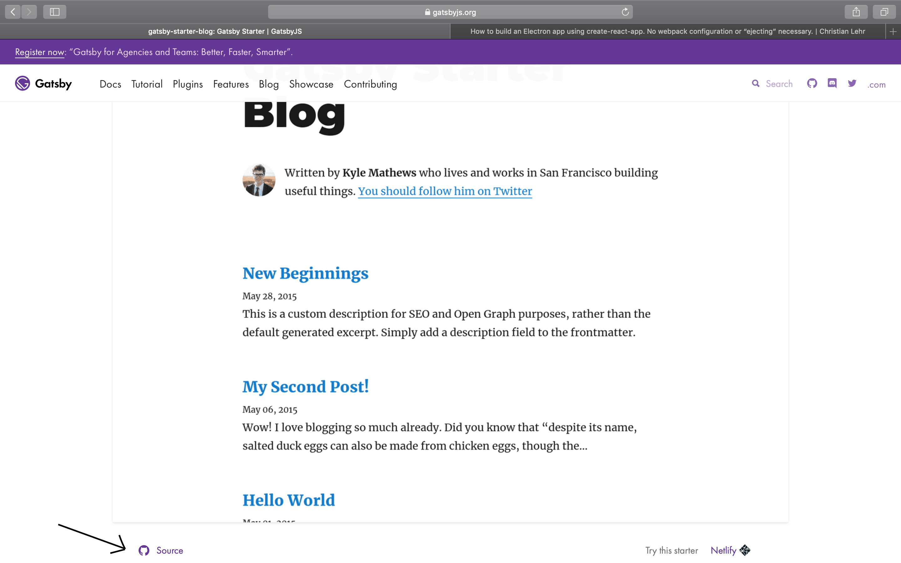

I am currently learning Gatsby (Gatsby is a free and open source framework based on React that helps developers build blazing fast websites and apps
                                
) and I thought what would be a good way to learn it?

I think the best way to learn a language/framework/library is to just build something with it and be creative and have fun with it.
At the same time I wanted to start my first own blog so I decided to kill two birds with one stone and develop my blog with gatsby.js`

(I heard from some frontend developers on a conference that it is
currently the new hype for react developers.)

Although I think the documentation from Gatsby is quite good it wasn't as on point as I wished for.
This is why I wanted to write a small post where I share with you how to setup and deploy a blog in under 5 minutes.

## Setup

First install the Gatsby CLI:

```none
npm install -g gatsby-cli
```

##Create your gatsby blog with a template:

```none
gatsby new my-first-blog https://github.com/gatsbyjs/gatsby-starter-blog
```

##(Optional) Search for your template
in this example I used the template `gatsby-starter-blog`. If you want to
use another template feel free to search for one that you like on the 
Gatsby site:

https://www.gatsbyjs.org/starters/?v=2

When you have found a template that you like, make sure to click on the Github source link
to get the right template url:



##(Optional) Make changes
If you want you can now already customize your blog.

## Run your blog locally

To run your blog locally run following command:

```none
gatsby develop
```

## Deploy your blog

To deploy your blog we will use `surge`.

1. Install Surge and create a free account:

```none
npm install --global surge

# Then create a (free) account with
surge
```

2. Build your production build (inside your root folder run):

```none
gatsby build
```

3. Deploy your application:

```none
surge public/
```

This command will generate a link like `http://possessive-angle.surge.sh/` that will contain your first blog.

Congratulations! You have created and deployed your first blog in under 5 minutes!


