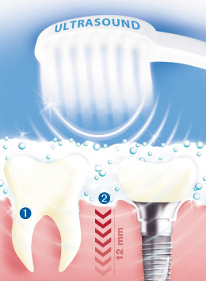

My sister works in a dentist practice so I asked her about ultrasonic toothbrushes and she told me
that dentists actually recommend them as they clean the teeth in the most soft and thoroughly way.

But what is so special about ultrasonic toothbrushes and what is the difference to normal
sonic toothbrushes?

The short answer is that **Ultrasonic toothbrushes** unlike sonic ones do not rely on a physical motion to clean the teeth.

An ultrasonic toothbrush is one that uses a very **high frequency** of vibration referred to as ultrasound to remove plaque and bacteria from the teeth
(to a certain degree even tartar).

 

The brush can clean the teeth simply by resting the brush on it though many ultrasonic use extra sonic waves 
to better remove the broken bacteria chains.

