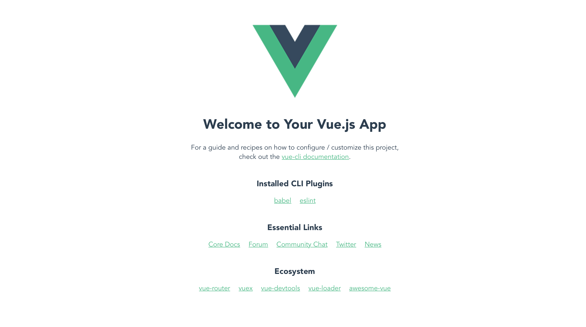
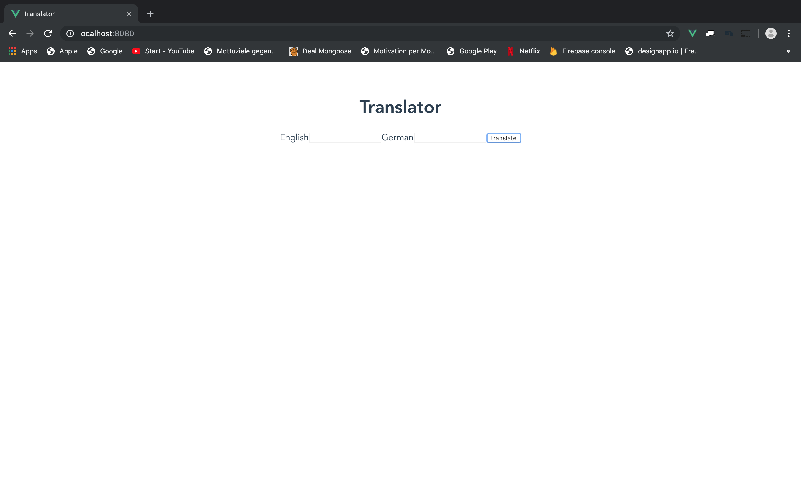
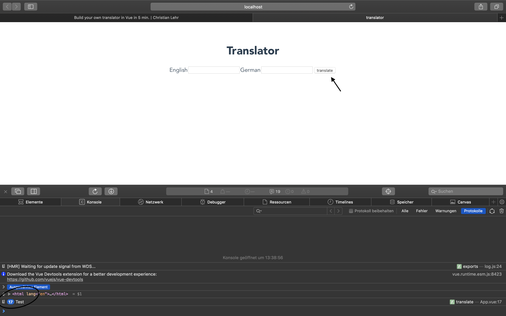

# Why a translator?

I think a translator fits well for one of your first projects as the functionality is easily understandable and not so complex.
In addition you will:

- easily create your project with the vue cli
- do first steps with vue
- make your first REST Call


# Setup your project

install:

```
npm install -g @vue/cli
# OR
yarn global add @vue/cli
```

create project:
```
vue create translator
```

just click through the settings. 

For your first projects there is no need to pay to much attention to it.


Start the project:

```
cd translator/
yarn serve
```

Visit the page http://localhost:8080/

you should see something like:




# Create the UI

Our UI in this scenario will be really simple.


1. Go into src/App.vue and delete the content inside the div so that you will have an empty page.

your App.vue will look like:

```javascript
<template>
  <div id="app">
  </div>
</template>

<script>
export default {
  name: 'app'
}
</script>

<style>
#app {
  font-family: 'Avenir', Helvetica, Arial, sans-serif;
  -webkit-font-smoothing: antialiased;
  -moz-osx-font-smoothing: grayscale;
  text-align: center;
  color: #2c3e50;
  margin-top: 60px;
}
</style>
```

2. Add the UI elements

We will have:

- 1 title
- 2 labels
- 2 input fields 
- 1 translate button

Afterwards your App.vue should look like this:


```javascript
<template>
  <div id="app">
    <h1>Translator</h1>
    <label>English</label>
    <input>
    <label>German</label>
    <input>
    <button>translate</button>
  </div>
</template>

<script>
export default {
  name: 'app'
}
</script>

<style>
#app {
  font-family: 'Avenir', Helvetica, Arial, sans-serif;
  -webkit-font-smoothing: antialiased;
  -moz-osx-font-smoothing: grayscale;
  text-align: center;
  color: #2c3e50;
  margin-top: 60px;
}
</style>
```

your browser should show you something like the following:



# Add the logic

When we click now on our button nothing will happen. Let's change this.

Also here we will go step by step:

1. Let's tell our button to do something!

For example just logging text to the console.

Therefor add an event handler to your button like this:

```javascript
    <button @click="translate">translate</button>
```

Also we have to define a method translate to tell our button WHAT to do. With the @click we tell the
button THAT it should do something when it gets CLICKED. The methods looks like this:

```javscript
translate() {
      console.log("Test")
    }
```

in total your component now should look like this:

```javascript
<template>
  <div id="app">
    <h1>Translator</h1>
    <label>English</label>
    <input>
    <label>German</label>
    <input>
    <button @click="translate">translate</button>
  </div>
</template>

<script>
export default {
  name: 'app',
  methods: {
    translate() {
      console.log("Test")
    }
  }
}
</script>

<style>
#app {
  font-family: 'Avenir', Helvetica, Arial, sans-serif;
  -webkit-font-smoothing: antialiased;
  -moz-osx-font-smoothing: grayscale;
  text-align: center;
  color: #2c3e50;
  margin-top: 60px;
}
</style>

```

if you go now to the browser and click the translate button you should see a text in your console:



2. Let's tell our German input field to contain the translated text:

Therfor we will add the data function to our component like this:

```javascript
<script>
export default {
  name: 'app',
  data() {
    return {
      translation: 'translated text'
    }
  },
  methods: {
    translate() {
      console.log("Test")
    }
  }
}
</script>
```

now we also have to use it in the template:

```javascript
    <input :placeholder="translation">

```

in total the component looks like:

```javascript
<template>
  <div id="app">
    <h1>Translator</h1>
    <label>English</label>
    <input>
    <label>German:</label>
    <input :placeholder="translation">
    <button @click="translate">translate</button>

  </div>
</template>

<script>
export default {
  name: 'app',
  data() {
    return {
      translation: 'translated text'
    }
  },
  methods: {
    translate() {
      console.log("Test")
    }
  }
}
</script>

<style>
#app {
  font-family: 'Avenir', Helvetica, Arial, sans-serif;
  -webkit-font-smoothing: antialiased;
  -moz-osx-font-smoothing: grayscale;
  text-align: center;
  color: #2c3e50;
  margin-top: 60px;
}
</style>

```

Now when you open the browser the input field should display our text 'translated text'.


3. Tell our button to update the text inside the input field:

```javascript
methods: {
    translate() {
      this.translation = 'it worked!'
    }
  }
```

When you click now on the button in your application you should see how the text of the input field changes.

4. Add axios to make a REST call

```
npm install --save axios
```

Import axios to your component above the export default:

```javascript
  import axios from 'axios';

  export default {...
```


5. Change your translate() method to make a GET call to the Google translation API and set the translation to result we will receive:

```javascript
methods: {
    translate: function () {
      let url = `https://translate.googleapis.com/translate_a/single?client=gtx&sl=en&tl=de&dt=t&q=dog`;
      axios.get(url)
              .then(response => {
                this.translation = response.data[0][0][0]
              })
              .catch(e => {
                this.errors.push(e)
              })
    }
  }
```

Try also to manually open the url in your browser:
      `https://translate.googleapis.com/translate_a/single?client=gtx&sl=en&tl=de&dt=t&q=dog`
      and have a look inside the json file that gets downloaded. This will be the data that we will be working with.
      
 
 You will see something like:
 
 ```
 [[["Hund","dog",null,null,1]],null,"en"]
 ```
 
 **response.data[0][0][0]** will give us the value **"Hund"**
 
6. Use the input field value for translations instead of hardcoded 'dog'
 
 So for now it does not matter what we put in our English input field. Because of the hardcoded URL the value of our response will alsways be "Hund".
 Let's change that! So instead of using dog inside **https://translate.googleapis.com/translate_a/single?client=gtx&sl=en&tl=de&dt=t&q=dog**
 we will use the input value of our input field.
 
 We can achieve this in 3 steps:
 
 a) Add a property textToTranslate to the data function
 
 ```javascript
 data() {
     return {
       textToTranslate: 'text to translate',
       translation: 'translated text'
     }
   }
 ```
 
 b) use the v-model directive to bind the input field to the property, so every time we change something in the input field
 the value for 'textToTranslate' inside the data() function gets updated
 
 ```javascript
 <label>English</label>
 <input v-model="textToTranslate">
 ```
 
 c) use the value of the input in our URL for the GET call:
 
 ```javascript
 methods: {
     translate: function () {
       let url = `https://translate.googleapis.com/translate_a/single?client=gtx&sl=en&tl=de&dt=t&q=${this.textToTranslate}`;
       axios.get(url)
               .then(response => {
                 this.translation = response.data[0][0][0]
               })
               .catch(e => {
                 this.errors.push(e)
               })
     }
 ```
 
 in total our component now should like this:
 
 
 ```javascript
 <template>
   <div id="app">
     <h1>Translator</h1>
     <label>English</label>
     <input v-model="textToTranslate">
     <label>German:</label>
     <input :placeholder="translation">
     <button @click="translate">translate</button>
 
   </div>
 </template>
 
 <script>
   import axios from 'axios';
 
   export default {
   name: 'app',
   data() {
     return {
       textToTranslate: 'text to translate',
       translation: 'translated text'
     }
   },
   methods: {
     translate: function () {
       let url = `https://translate.googleapis.com/translate_a/single?client=gtx&sl=en&tl=de&dt=t&q=${this.textToTranslate}`;
       axios.get(url)
               .then(response => {
                 this.translation = response.data[0][0][0]
               })
               .catch(e => {
                 this.errors.push(e)
               })
     }
   }
 }
 </script>
 
 <style>
 #app {
   font-family: 'Avenir', Helvetica, Arial, sans-serif;
   -webkit-font-smoothing: antialiased;
   -moz-osx-font-smoothing: grayscale;
   text-align: center;
   color: #2c3e50;
   margin-top: 60px;
 }
 </style>

 ```
 
 if you open the browser now and type something in the English input field and click on translate you should see the German translation.
 
 
 That's it! You did it!
 
 
 # Ideas for improving
 
 If you want to enhance the functionality of your translator you could:
 
 - Style it with CSS 
 - Add more languages 
 - Build a switch button that swaps both languages (like Google translator)
 
 
 If you want to see an example that I build you can see it under:
 
 https://translatable.netlify.com
 
 It's a prototype for an application that shall help people learning languages in a more fun intuitive way.
 
 
 
 

      


