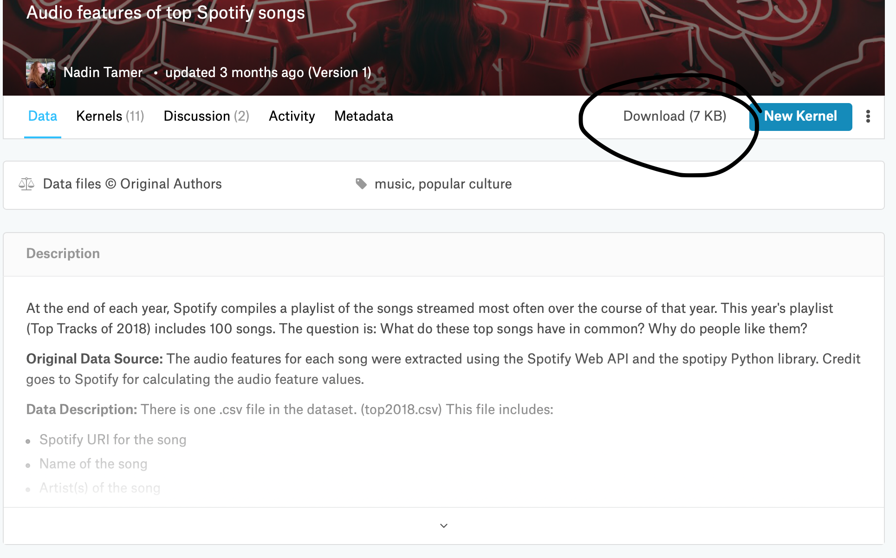
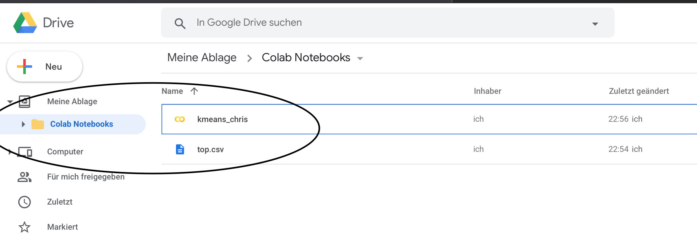
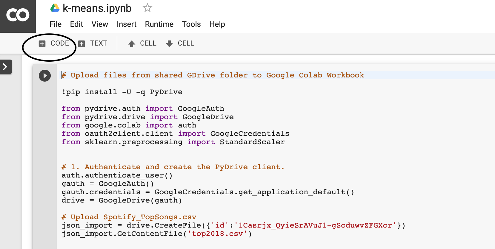
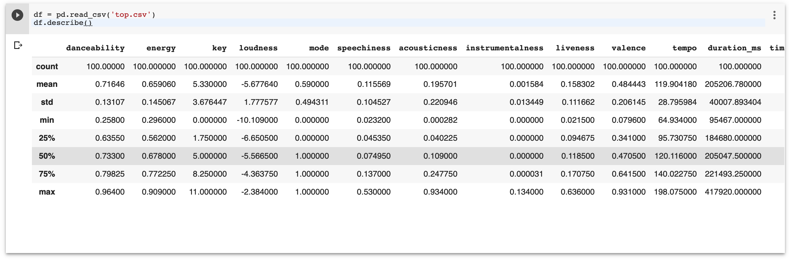
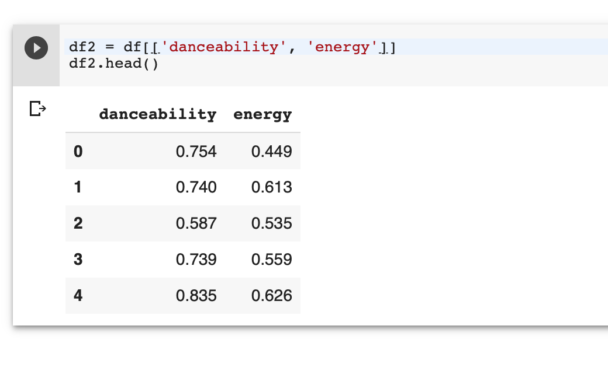

1. Go to https://colab.research.google.com/

2. Create a new Python 3 Notebook.

3. Download dataset of your choice from:
   https://www.kaggle.com/datasets?sortBy=hotness&group=public&page=1&pageSize=20&size=all&filetype=all&license=all

   In this example I will use:
   https://www.kaggle.com/nadintamer/top-spotify-tracks-of-2018
   
   

  
4. Save your will file (top2018.csv in our case) next to where your google jupiter notebook is.

    

    
5. Add a new code section by hitting the plus sign on the Code Tab

    

    
    Copy & Paste the following to do the setup for your Notebook and execute it by hitting on the play button:
    
    ```Python
     Upload files from shared GDrive folder to Google Colab Workbook
    
    !pip install -U -q PyDrive
    
    from pydrive.auth import GoogleAuth
    from pydrive.drive import GoogleDrive
    from google.colab import auth
    from oauth2client.client import GoogleCredentials
    from sklearn.preprocessing import StandardScaler
    
    
    # 1. Authenticate and create the PyDrive client.
    auth.authenticate_user()
    gauth = GoogleAuth()
    gauth.credentials = GoogleCredentials.get_application_default()
    drive = GoogleDrive(gauth)
    
    # Upload Spotify_TopSongs.csv
    json_import = drive.CreateFile({'id':'1Casrjx_QyieSrAVuJ1-gScduwvZFGXcr'})
    json_import.GetContentFile('top2018.csv')
    ```
    
    Note: it will probably ask you to go to another site. On that site you will find the key you have to enter into the upcoming input field 
    for verification.
    
6. Add a new code section and import some libraries that we need to do our operations later
   
   ```Python
   %matplotlib inline
   import matplotlib.pyplot as plt
   import seaborn as sns; sns.set()  # for plot styling
   import numpy as np
   import pandas as pd
   ```
   
7. Add a new code section --> save your dataset in a variable and get a first overview of your data with .describe()

    ```Python
    df = pd.read_csv('top.csv')
    df.describe()
    ```
    
    you should see something like this:
    
    
    
8. Now you can choose two columns you want to compare

    In this example we will take danceability and energy.
    
    Therefor we make a new variable that will only contain the data we need.
    
    
    ```Python
    
    df2 = df[['name','danceability', 'energy']]
    df2.head()
    
    ```
    
    head() shows you something like:
    
    
    
9. It's time to scatter plot our data to see how they look like visually

    Add a new code section with following content:

    ```Python
    scatter1 = plt.scatter(df2['danceability'], df2['energy'])
    ## plt.scatter(x, y, s=area, c=colors, alpha=0.5)
    plt.xlabel('Danceability', fontsize=10)
    plt.ylabel('Energy', fontsize=10)
    ```
    
    It will show us following:
    
    ")
    
     
10. Use the kmeans algorithm to cluster our data into groups:

    ```Python
    #use the kmeans algorithm on our data
    
    from sklearn.cluster import KMeans
    
    kmeans = KMeans(n_clusters=3)
    kmeans.fit(df2)
    y_kmeans = kmeans.predict(df2)
    
    
    #scatter our data with colors
    
    plt.scatter(df2['danceability'], df2['energy'], c=y_kmeans, s=50, cmap='viridis')
    
    centers = kmeans.cluster_centers_
    plt.scatter(centers[:, 0], centers[:, 1], c='black', s=200, alpha=0.5)
    ```
    
    it should show us following:
    
    
                                but still you get an idea of how it might work. If you want you can try other datasets from Keggle and maybe you will find
                                data that can be clustered more easily.")
    
    


    
    
    
    
   

   

