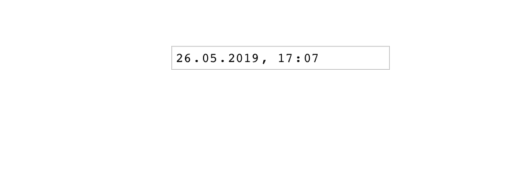

##Setup project with Vue

1. Install Vue CLI:

```
npm install -g @vue/cli
```

2. Create your vue application:

```
vue create datepicker
```

##Add momentjs

```
cd datepicker
yarn add vue-moment
```
**MomentJs** is a library to parse, validate, manipulate, and display dates and times in JavaScript.
I can really recommend it when you are working with dates because it is easy to use.

##Start Application

```
yarn serve
```

## Add datepicker input and set value with momentjs

To set your input value to today with the current time use: 

```javascript
moment().format(moment.HTML5_FMT.DATETIME_LOCAL)
```

Inside your **src/App.vue** the code should look like this:

```vuejs
<template>
  <div id="app">
    <input type="datetime-local" v-model="date">
  </div>
</template>

<script>
  import moment from "moment";

  export default {
    name: 'app',
    data: function () {
      return {
        date: moment().format(moment.HTML5_FMT.DATETIME_LOCAL),
      };
    }
  }
</script>

<style>
#app {
  font-family: 'Avenir', Helvetica, Arial, sans-serif;
  -webkit-font-smoothing: antialiased;
  -moz-osx-font-smoothing: grayscale;
  text-align: center;
  color: #2c3e50;
  margin-top: 60px;
}
</style>
```

That's it! At the end you should see this as a result:

 
 
 
 ##Resources
 
 Link to the **momentjs** site for further information on how to use:  
 http://momentjs.com

   
   

    


    
    
    
    
   

   

